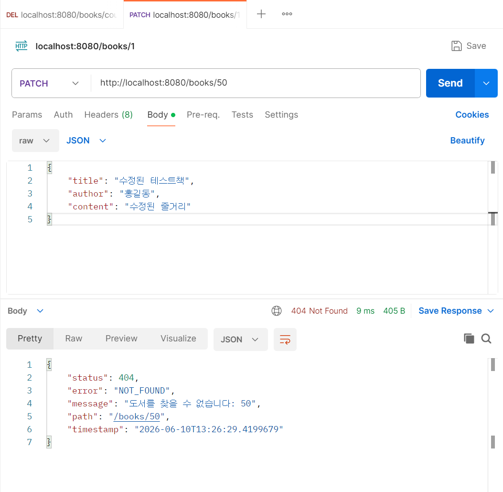
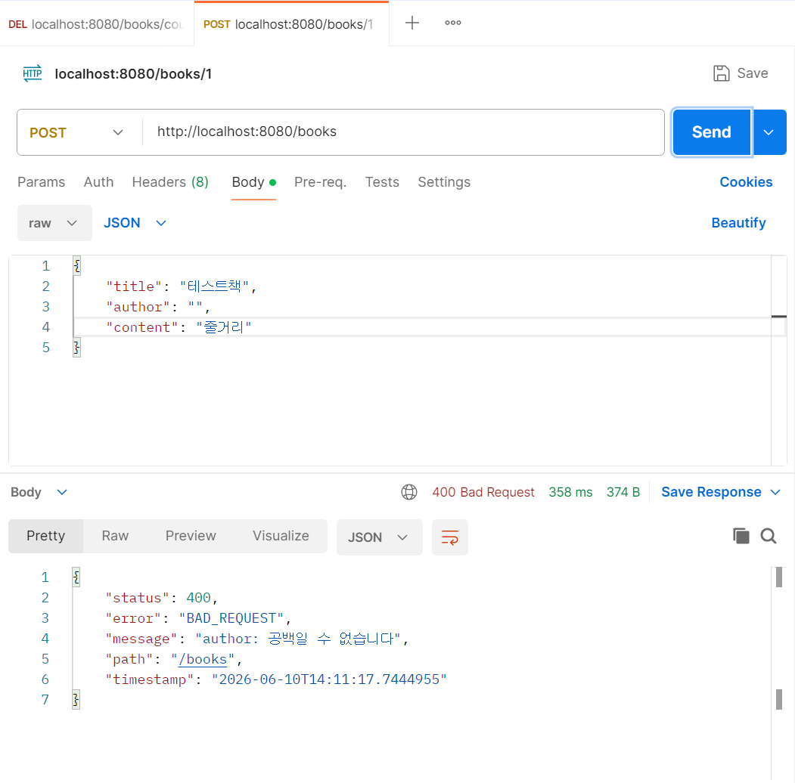
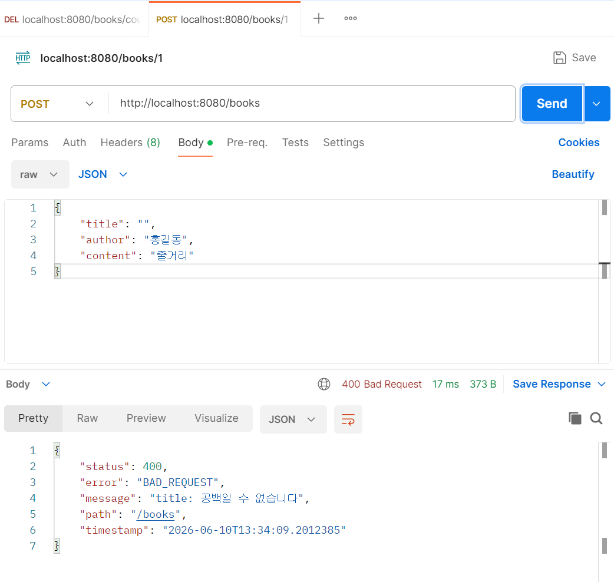

# 5차 미니 프로젝트 - 도서관리시스템 서버 개발

## 1. 프로젝트 개요

본 프로젝트는 기존 Frontend 미니프로젝트에서 사용하던 `json-server` 기반 데이터 관리를 Spring Boot 서버로 전환한 도서관리시스템이다.

사용자는 도서를 등록, 조회, 수정, 삭제할 수 있으며, 도서에 대한 리뷰를 작성하고 관리할 수 있다. 또한 도서 제목과 내용을 기반으로 OpenAI Image Generation API를 호출하여 AI 표지 이미지를 생성하고, 생성된 이미지를 Backend에 저장하여 도서 목록 및 상세 화면에 반영할 수 있다.

본 프로젝트의 핵심 목표는 다음과 같다.

* Spring Boot 기반 REST API 서버 구현
* JPA와 H2 Database를 활용한 도서 데이터 관리
* React Frontend와 Spring Boot Backend 연동
* 도서 CRUD 기능 구현
* 리뷰 CRUD 기능 구현
* 도서 좋아요 증가 기능 구현
* OpenAI API를 활용한 AI 표지 이미지 생성 및 저장
* 전역 예외 처리와 유효성 검증 적용
* GitHub 기반 팀 협업 및 최종 시연

---

## 2. 팀원 R&R

| 이름 | 역할 | 담당 내용 |
| -- | ----------- | ----- |
| 이은선 | PM / 문서화 | API 정의서, README.md 작성, 프로젝트 총괄 점검 |
| 한준우 | Backend 개발 | Entity 작성, Repository 관리, H2 콘솔, Lombok 적용 |
| 서한석 | Backend 개발 | Service 클래스, 비즈니스 로직, 예외 처리, @Transactional |
| 최준석 | Backend 개발 | Controller 관리, CRUD 엔드포인트 점검, @Valid+@NotBlank, Postman 테스트 |
| 조은진 | AI/Frontend 연동 | Frontend 코드 분석 및 연동, OpenAI 표지 흐름, E2E 시연 |
| 양경동 | 통합 / 예외처리 | WebConfig(CORS), 전역 예외 처리, 풀스택 디버깅, 트러블슈팅 |

---

## 3. 주요 기능

### 3.1 도서 관리 기능

* 도서 목록 조회
* 도서 상세 조회
* 신규 도서 등록
* 도서 정보 수정
* 도서 좋아요 증가
* 도서 삭제
* AI 생성 표지 이미지 저장

### 3.2 리뷰 관리 기능

* 전체 리뷰 조회
* 특정 도서의 리뷰 조회
* 리뷰 등록
* 리뷰 수정
* 리뷰 삭제

### 3.3 AI 표지 이미지 생성 기능

* 도서 제목과 내용을 기반으로 이미지 생성 프롬프트 구성
* Frontend에서 OpenAI Image Generation API 직접 호출
* OpenAI 응답의 `b64_json` 값을 Data URL 형식으로 변환
* 변환된 표지 이미지를 Backend의 도서 표지 저장 API로 전달
* 저장된 표지를 도서 목록 및 상세 화면에 반영

---

## 4. 기술 스택

| 구분 | 기술 |
| -------- | ---------------------------------------------- |
| Frontend | React 19, Vite, JavaScript, fetch API |
| Backend | Java, Spring Boot, Spring MVC, Spring Data JPA |
| Database | H2 Database |
| ORM | JPA, Hibernate |
| Library | Lombok, Validation |
| AI API | OpenAI Image Generation API |
| 협업 | GitHub |
| API 테스트 | Postman |
| 개발 환경 | IntelliJ IDEA, VS Code |

---

## 5. 시스템 구성

```txt
React Frontend
    |
    | HTTP Request
    v
Spring Boot Backend
    |
    | JPA
    v
H2 Database
```

AI 표지 생성 흐름은 다음과 같다.

```txt
React
  → OpenAI API 호출
  → b64_json 응답 수신
  → Data URL 변환
  → Spring Boot Backend로 표지 저장 요청
  → H2 Database에 coverImageUrl 저장
```

---

## 6. 프로젝트 구조

```txt
aivle_miniproject_v2
├─ backend
│  ├─ src
│  │  └─ main
│  │     ├─ java
│  │     │  └─ com
│  │     │     └─ aivle
│  │     │        └─ backend
│  │     │           ├─ config
│  │     │           ├─ controller
│  │     │           ├─ entity
│  │     │           ├─ exception
│  │     │           ├─ repository
│  │     │           └─ service
│  │     └─ resources
│  │        └─ application.yaml
│  ├─ build.gradle
│  └─ settings.gradle
│
├─ frontend
│  ├─ components
│  ├─ public
│  ├─ src
│  ├─ package.json
│  └─ vite.config.js
│
├─ screenshots
├─ API정의서.md
├─ README.md
├─ db.json
└─ server.cjs
```

---

## 7. Backend 주요 구조

### 7.1 Entity

#### Book

도서 정보를 저장하는 엔티티이다.

| 필드명 | 설명 |
| --------------- | ---------------------- |
| `id` | 도서 ID |
| `title` | 도서 제목 |
| `author` | 작가명 |
| `content` | 도서 내용 |
| `coverImageUrl` | 표지 이미지 URL 또는 Data URL |
| `likes` | 좋아요 수 |
| `createdAt` | 생성 시각 |
| `updatedAt` | 수정 시각 |

#### Review

도서 리뷰 정보를 저장하는 엔티티이다.

| 필드명 | 설명 |
| ----------- | ------------- |
| `id` | 리뷰 ID |
| `bookId` | 리뷰가 연결된 도서 ID |
| `nickname` | 리뷰 작성자 닉네임 |
| `content` | 리뷰 내용 |
| `createdAt` | 생성 시각 |
| `updatedAt` | 수정 시각 |

---

## 8. API 요약

자세한 요청/응답 구조는 `API정의서.md`를 참고한다.

### 8.1 Books API

| 기능 | Method | URL |
| ------------ | ------ | ------------------- |
| 도서 목록 조회 | GET | `/books` |
| 도서 상세 조회 | GET | `/books/{id}` |
| 도서 등록 | POST | `/books` |
| 도서 수정 | PATCH | `/books/{id}` |
| AI 표지 이미지 저장 | PATCH | `/books/{id}/cover` |
| 도서 좋아요 증가 | PATCH | `/books/{id}/like` |
| 도서 삭제 | DELETE | `/books/{id}` |

### 8.2 Reviews API

| 기능 | Method | URL |
| ----------- | ------ | -------------------------- |
| 리뷰 전체 조회 | GET | `/reviews` |
| 특정 도서 리뷰 조회 | GET | `/reviews?bookId={bookId}` |
| 리뷰 등록 | POST | `/reviews` |
| 리뷰 수정 | PATCH | `/reviews/{id}` |
| 리뷰 삭제 | DELETE | `/reviews/{id}` |

---

## 9. 실행 방법

### 9.1 Backend 실행

#### 1. Backend 폴더로 이동

```bash
cd backend
```

#### 2. Spring Boot 서버 실행

Windows 환경:

```bash
gradlew.bat bootRun
```

Mac 또는 Linux 환경:

```bash
./gradlew bootRun
```

#### 3. Backend 서버 접속 주소

```txt
http://localhost:8080
```

#### 4. H2 Console 접속

```txt
http://localhost:8080/h2-console
```

H2 접속 정보:

```txt
JDBC URL: jdbc:h2:mem:bookdb
User Name: sa
Password:
```

---

### 9.2 Frontend 실행

#### 1. Frontend 폴더로 이동

```bash
cd frontend
```

#### 2. 패키지 설치

```bash
npm install
```

#### 3. 개발 서버 실행

```bash
npm run dev
```

#### 4. Frontend 접속 주소

```txt
http://localhost:5173
```

---

## 10. 시연 테스트 시나리오

### 10.1 도서 CRUD 테스트

| 순서 | 테스트 항목 | 확인 내용 |
| -: | --------- | ------------------------------------------- |
| 1 | 도서 목록 조회 | 메인 화면에서 등록된 도서 목록이 표시되는지 확인 |
| 2 | 도서 등록 | 제목, 작가명, 본문 입력 후 새 도서가 목록에 추가되는지 확인 |
| 3 | 도서 상세 조회 | 선택한 도서의 제목, 작가명, 본문, 표지, 작성일, 수정일이 표시되는지 확인 |
| 4 | 도서 수정 | 수정한 도서 정보가 상세 화면과 목록 화면에 반영되는지 확인 |
| 5 | 도서 좋아요 증가 | 좋아요 버튼 클릭 시 좋아요 수가 증가하는지 확인 |
| 6 | 도서 삭제 | 삭제 후 목록에서 해당 도서가 제거되는지 확인 |

---

### 10.2 리뷰 CRUD 테스트

| 순서 | 테스트 항목 | 확인 내용 |
| -: | ------ | ------------------------------------ |
| 1 | 리뷰 등록 | 닉네임과 리뷰 내용을 입력하면 리뷰가 등록되는지 확인 |
| 2 | 리뷰 조회 | 특정 도서 상세 화면에서 해당 도서의 리뷰 목록이 조회되는지 확인 |
| 3 | 리뷰 수정 | 수정한 리뷰 내용이 화면에 반영되는지 확인 |
| 4 | 리뷰 삭제 | 삭제 후 리뷰 목록에서 해당 리뷰가 제거되는지 확인 |

---

### 10.3 AI 표지 생성 테스트

| 순서 | 테스트 항목 | 확인 내용 |
| -: | ----------------- | --------------------------------------- |
| 1 | OpenAI API Key 입력 | 사용자의 OpenAI API Key를 입력한다 |
| 2 | 표지 생성 요청 | 도서 제목과 내용을 기반으로 이미지 생성 요청을 보낸다 |
| 3 | 이미지 응답 처리 | OpenAI 응답의 `b64_json` 값을 Data URL로 변환한다 |
| 4 | 표지 저장 | 변환된 Data URL을 Backend에 저장한다 |
| 5 | 화면 반영 | 생성된 표지가 도서 상세 화면과 목록 화면에 표시되는지 확인한다 |

---

## 11. Postman 테스트 항목

### 11.1 Books API

| 기능 | Method | URL | 주요 Body |
| --------- | ------ | ---------------------------------------- | --------------------------------------------- |
| 도서 등록 | POST | `http://localhost:8080/books` | `title`, `author`, `content`, `coverImageUrl` |
| 도서 목록 조회 | GET | `http://localhost:8080/books` | 없음 |
| 도서 상세 조회 | GET | `http://localhost:8080/books/{id}` | 없음 |
| 도서 수정 | PATCH | `http://localhost:8080/books/{id}` | 수정할 필드 |
| AI 표지 저장 | PATCH | `http://localhost:8080/books/{id}/cover` | `coverImageUrl` |
| 도서 좋아요 증가 | PATCH | `http://localhost:8080/books/{id}/like` | 없음 |
| 도서 삭제 | DELETE | `http://localhost:8080/books/{id}` | 없음 |

### 11.2 Reviews API

| 기능 | Method | URL | 주요 Body |
| ----------- | ------ | ----------------------------------------------- | ------------------------------- |
| 리뷰 등록 | POST | `http://localhost:8080/reviews` | `bookId`, `nickname`, `content` |
| 전체 리뷰 조회 | GET | `http://localhost:8080/reviews` | 없음 |
| 특정 도서 리뷰 조회 | GET | `http://localhost:8080/reviews?bookId={bookId}` | 없음 |
| 리뷰 수정 | PATCH | `http://localhost:8080/reviews/{id}` | 수정할 필드 |
| 리뷰 삭제 | DELETE | `http://localhost:8080/reviews/{id}` | 없음 |

---

## 12. 예외 처리

본 프로젝트는 전역 예외 처리를 통해 API 오류 응답 형식을 통일하였다.

### 12.1 도서 또는 리뷰를 찾을 수 없는 경우

```json
{
  "status": 404,
  "error": "NOT_FOUND",
  "message": "도서를 찾을 수 없습니다.",
  "path": "/books/999",
  "timestamp": "2026-05-22T10:00:00"
}
```

### 12.2 유효성 검증 실패

```json
{
  "status": 400,
  "error": "BAD_REQUEST",
  "message": "도서명은 필수입니다.",
  "path": "/books",
  "timestamp": "2026-05-22T10:00:00"
}
```

---

## 13. 트러블슈팅

| 문제 상황 | 원인 | 해결 방법 |
| --------------------------------------- | ------------------------------------------------ | ---------------------------------------------------- |
| React에서 Spring Boot API 호출 시 CORS 오류 발생 | Frontend와 Backend의 포트가 달라 브라우저 보안 정책에 의해 요청 차단 | `WebConfig.java`에서 `http://localhost:5173` Origin 허용 |
| Frontend 요청이 json-server로 전송됨 | 기존 Frontend 코드의 API 주소가 `localhost:3000`으로 남아 있음 | API 요청 주소를 `http://localhost:8080`으로 수정 |
| H2 Console 접속 실패 | JDBC URL 또는 서버 실행 상태 문제 | Spring Boot 실행 여부 확인 후 H2 접속 정보 확인 |
| 도서 상세 조회 시 404 발생 | 존재하지 않는 도서 ID 요청 | 사용자 정의 예외와 전역 예외 처리로 404 응답 반환 |
| 필수 입력값 없이 등록 시 오류 발생 | 제목, 작가명, 본문 내용 등 필수값 누락 | 검증 어노테이션과 전역 예외 처리로 400 응답 반환 |
| OpenAI 이미지 생성 실패 | API Key 미입력 또는 잘못된 Key 사용 | 사용자의 OpenAI API Key를 입력하고 Authorization 헤더 형식 확인 |
| GitHub에 API Key가 올라갈 위험 | API Key를 코드에 하드코딩할 경우 보안 문제 발생 | API Key는 사용자가 화면에서 직접 입력하고 코드에는 저장하지 않음 |
| 표지 이미지가 화면에 바로 반영되지 않음 | Backend 저장 후 Frontend 상태 갱신 누락 | 표지 저장 API 호출 후 도서 상세 정보를 다시 조회하거나 상태값 갱신 |

---

## 14. 주요 구현 결과

### 14.1 json-server에서 Spring Boot로 전환

기존 Frontend 미니프로젝트에서 사용하던 `json-server` 기반 임시 API를 Spring Boot Backend로 대체하였다. 이를 통해 도서 데이터가 JPA와 H2 Database를 통해 관리되도록 구현하였다.

### 14.2 도서 CRUD 기능 구현

도서 목록 조회, 상세 조회, 등록, 수정, 삭제 기능을 REST API로 구현하였다. Frontend에서는 fetch API를 통해 Backend와 통신하며, 사용자의 입력 결과가 화면과 데이터베이스에 반영되도록 구성하였다.

### 14.3 도서 좋아요 증가 기능 구현

도서 상세 또는 목록 화면에서 좋아요 요청을 보내면 Backend에서 해당 도서의 `likes` 값을 증가시키고, 변경된 결과가 화면에 반영되도록 구현하였다.

### 14.4 리뷰 CRUD 기능 구현

도서별 리뷰 작성 및 조회 기능을 구현하였다. 리뷰는 `bookId`를 기준으로 도서와 연결되며, 닉네임과 리뷰 내용을 저장할 수 있다.

### 14.5 AI 표지 이미지 생성 흐름 구현

Frontend에서 OpenAI API를 직접 호출하여 도서 내용에 맞는 표지 이미지를 생성하였다. 생성된 이미지는 Data URL 형식으로 변환한 뒤 Backend에 저장되며, 도서 상세 화면과 목록 화면에서 확인할 수 있다.

### 14.6 예외 처리 구조 적용

도서 또는 리뷰를 찾을 수 없는 경우와 유효성 검증 실패 상황에 대해 전역 예외 처리 구조를 적용하였다. 이를 통해 API 오류 응답 형식을 일관되게 유지하였다.

### 14.7 Frontend-Backend 통합

React Frontend와 Spring Boot Backend를 연동하여 도서 등록, 조회, 수정, 삭제, 좋아요 증가, 리뷰 관리, AI 표지 저장 흐름을 통합하였다. CORS 설정을 통해 `localhost:5173`에서 `localhost:8080`으로 API 요청이 가능하도록 처리하였다.

---

## 15. Postman 및 H2 테스트

### CRUD

1. 생성


2. 읽기


3. 수정


4. 삭제


### ERROR 확인

1. 404


2. 400



---

## 16. E2E 시연 흐름

### 1. Frontend 접속


### 2. 도서 목록 확인


### 3. 도서 등록 (OpenAI API Key 입력 → AI 표지 생성)


### 4. 도서 상세 페이지 이동


### 5. 생성된 표지 저장 및 화면 반영


### 6. 도서 좋아요 증가
| 증가 전 | 증가 후 |
|---|---|
|  |  |

### 7. 리뷰 등록
| 등록 전 | 등록 후 |
|---|---|
|  |  |

### 8. 도서 정보 수정


### 9. 리뷰 수정
| 수정 전 | 수정 후 |
|---|---|
|  |  |

### 9-2. 리뷰 삭제
| 삭제 전 | 삭제 후 |
|---|---|
|  |  |

### 10. 도서 삭제
| 삭제 확인 알림 | 삭제 대상 도서 |
|---|---|
|  |  |

---

## 17. 프로젝트 의의

본 프로젝트를 통해 단순한 정적 데이터 관리 방식에서 벗어나 Spring Boot 기반의 Backend API 서버를 직접 구현하였다. 또한 React와 Spring Boot의 통신 구조를 이해하고, JPA를 활용한 데이터 영속성 처리와 전역 예외 처리 구조를 적용하였다.

AI 표지 생성 기능을 통해 외부 API를 실제 서비스 흐름에 연결하는 경험을 수행했으며, 도서 등록부터 AI 표지 생성, 저장, 화면 반영까지 이어지는 전체 E2E 흐름을 구현하였다.
